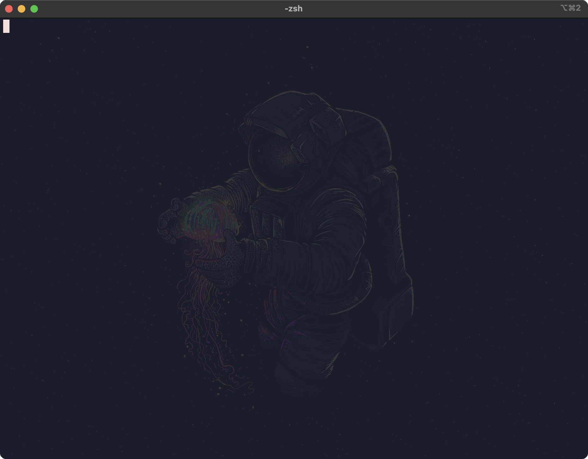

# notes-tui
Project demonstrating a basic use of bubbletea and other charm doodads.

## Dependencies
* Go
* SQLite3
* SQLite3 driver
  * `go get github.com/mattn/go-sqlite3`
* Bubbletea
  * `go get github.com/charmbracelet/bubbletea`
* Textarea
  * `go get github.com/charmbracelet/bubbles/textarea`
* TextInput
  * `go get github.com/charmbracelet/bubbles/textinput`
* Lipgloss
  * `go get github.com/charmbracelet/lipgloss`

## What is this...
A simple TUI notes app that stores your notes in a local sqlite3 db: notes.db.

It can do the following:
* create new notes: title and a text blob
* edit existing notes: you can change the content of the note, but the title is immutable.
* delete existing notes: once you are the note view, you can delete the note.

| key            | action       | screen                           |
|----------------|--------------|----------------------------------|
| n              | new note     | main note listing                |
| esc/q          | quit         | main note listing                |
| esc/q          | leave screen | creating, editing, delete a note |
| ctrl+s         | save         | creating and editing a note      |
| ctrl+d (twice) | delete       | creating a note, editing a note  |
| esc/q          | leave screen | creating, editing, delete a note |

## Demo
